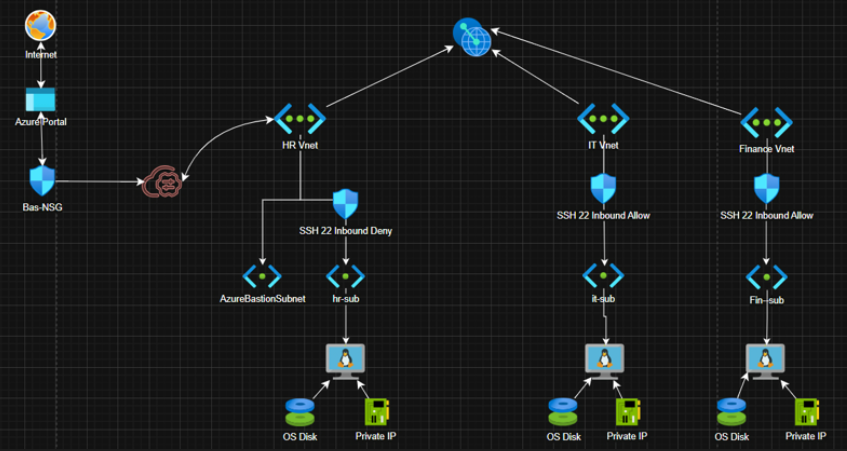

# Azure VNet Arch with Bastion, NSGs & Subnet Isolation

## Description
This project creates a secure and isolated Azure infrastructure using multiple Virtual Networks (VNets) and subnets. It leverages Azure Bastion for secure RDP/SSH access without exposing public IPs and Network Security Groups (NSGs) for traffic control and isolation.

### Key Features
1. Segregated VNets for HR, IT, and Finance with specific security rules.
2. Azure Bastion Host for secure VM access.
3. Private VMs with no direct internet exposure.
4. Network Security Groups to enforce strict access control.

### infra Overview
1. Azure Bastion Host: Provides secure RDP/SSH access without public IPs.
2. HR VNet: SSH (port 22) access is blocked 
3. IT and Finance VNets: SSH access allowed for management
4. NSGs: Implement strict traffic control rules.
5. Virtual Machines: Linux VMs with private IPs and no direct internet access.

### Infra Diagram


## Prerequisites
- Terraform installed (>= 4.16.0)
- az
- Access to an Azure subscription
- Service Principal with required permissions

## Setup and Configuration

1. Clone the repository

2. Run this command in your cmd to set the environment variables:
   ```bash
   set "TF_VAR_current_subscription_id=<sub-id>" & set "TF_VAR_current_tenant_id=<tenant-id>"

3. Generate SSH Key Pair, we need 3 key pairs for each VM
   ```bash
   ssh-keygen -t rsa -b 2048
  
4. Add the generated public key paths in the vm\main.tf file at:
- Line 32
- Line 88
- Line 144

**Each VM should have its .pub file**


5. Building the config
   ```bash
   az login
   terraform init
   terraform apply -var-file=tfvars\test.tfvars

## Contributing
Contributions are welcome! Please submit a pull request or raise an issue for any improvements.
